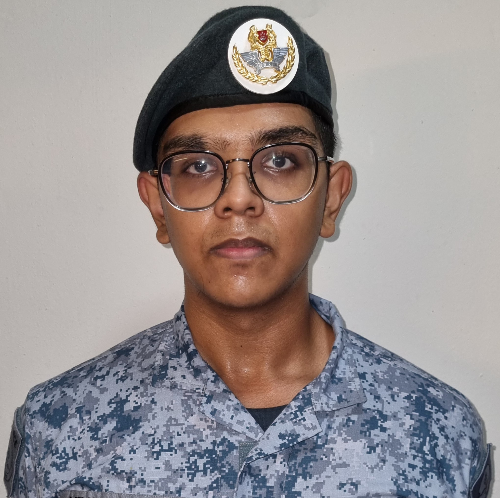
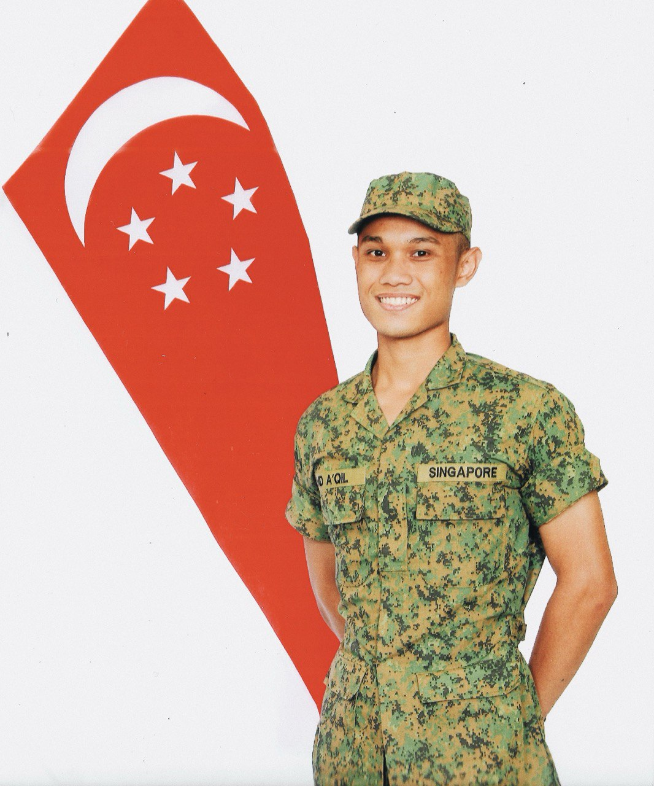
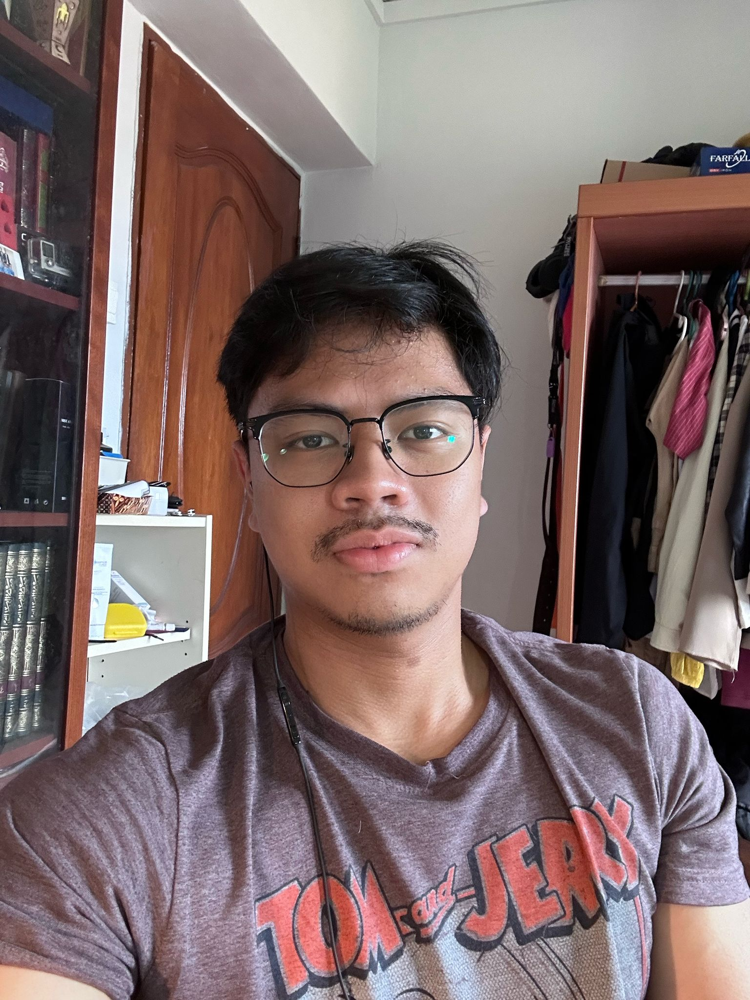
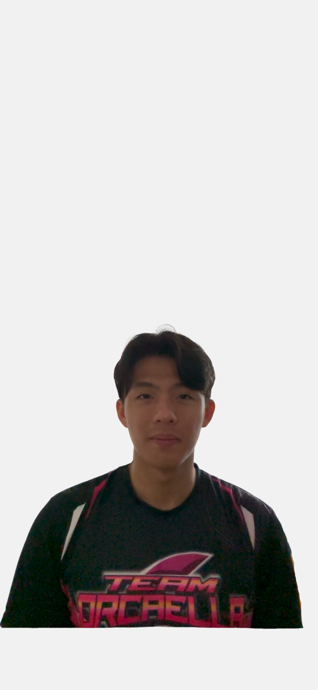

# About Us

We are a team based in the [School of Computing, National University of Singapore](http://www.comp.nus.edu.sg).

You can find us sweating in COM1

## Project team

### Yashvan Alagirisamy |`alagirisamyyashvan@gmail.com`

[[github](https://github.com/YashvanGH)]
[[portfolio](team/yashvangh.md)]

* Role: Dedicated Team Slacker (Fax)
* Responsibilities: Lead Through Fear, Join the zoom call, and make sure everyone is awake

### Muhammad A'qil |`qilstianooo@gmail.com`

[[github](http://github.com/qilstiano)] [[portfolio](team/qilstiano.md)]

* Role: Developer & Clown
* Responsibilities: CI/CD, Backend & Tomfoolery

### Benjamin Wang |`ben.wang9000@gmail.com`

[[github](https://github.com/Benjam11n)]
[[portfolio](team/benjam11n.md)]

* Role: Developer
* Responsibilities: Everything in between

### Abdul Hakam Bin Nor Razak |`abdulhakamnr@gmail.com`

[[github](http://github.com/adobleb)]
[[portfolio](team/adoubleb.md)]

* Role: Developer
* Responsibilities: UI, Step up your game, and make sure everyone is awake

### Tok Jun Hui Nicholas |`nicholastok0101@gmail.com`

[[github](http://github.com/nictjh)]
[[portfolio](team/nictok.md)]

* Role: Developer
* Responsibilities: BEING the best TEAMMATE ever

