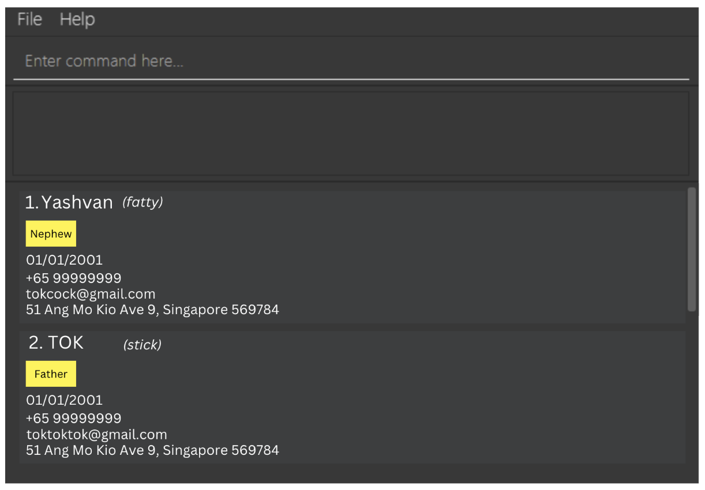

# WhoAreYouAgain? – Never Forget Who’s Who Again!

Your family tree is a tangled mess, and every gathering feels like an **oral exam** you didn’t prepare for. Who was that cousin again? And what was your aunt’s dog’s name?

**WhoAreYouAgain?** is the **hilariously practical family address book** that saves you from awkward stares and frantic name-guessing at reunions. Designed as a **desktop application**, it provides a GUI on top of the Command Line Interface (CLI), making it fast and efficient to use.

* If you are interested in using WhoAreYouAgain, head over to the [_Quick Start_ section of the **User Guide**](UserGuide.html#quick-start).
* If you are interested about developing WhoAreYouAgain, the [**Developer Guide**](DeveloperGuide.html) is a good place to start.

**Acknowledgements**

* Libraries used: [JavaFX](https://openjfx.io/), [Jackson](https://github.com/FasterXML/jackson), [JUnit5](https://github.com/junit-team/junit5)
* This project is based on the AddressBook-Level3 project created by the [SE-EDU initiative](https://se-education.org).
